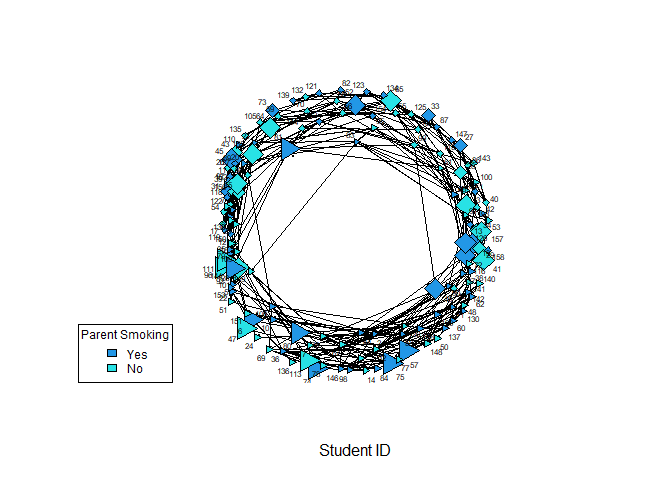

NCRM SNA Short Course Project
================
School of Health and Wellbeing - UofG
September, 2023

## Teenage Friends and Lifestyle Data

The data was downloaded from the SIENA Data Repository under Open
License Access, this also includes documentation for the Survey Design
by [West et
al. (1997)](https://www.stats.ox.ac.uk/~snijders/siena/Glasgow_data.htm).
The Glasgow Teenage data set consists of three waves, for the purpose of
this task we look at a cross-sectional snapshot extracting Wave 2
outcomes.

## 01 - Dependencies

Load dependencies including that of `library(statnet)` to be able to
parse data as Network objects. We also tap into data-processing
libraries including `library(dplyr)`.

```{r dependencies, echo=T, messages=F}
# Pass the set of libraries we intend to load as a list
libraries <- c("statnet","dplyr","ggplot2","formatR")

wants <- libraries
has   <- wants %in% rownames(installed.packages())

# Adapted code to check if packages have already been installed
if(any(!has)) install.packages(wants[!has])

lapply(wants, library, character.only=TRUE, warn.conflicts=F, quietly=T)
```

Next load the survey files covering aspects from students’ lifestyle to
friendship through the *Teenage Friends and Lifestyle Dataset*.

``` r
setwd("../SNA_Sept_2023/Glasgow_data/")

load("Glasgow-friendship.RData")
load("Glasgow-substances.RData")
load("Glasgow-geographic.RData")
load("Glasgow-demographic.RData")
load("Glasgow-geographic.RData")
load("Glasgow-lifestyle.RData")
load("Glasgow-various.RData")
```

## 02 - Read Network Data Structure

We map the elements of the Wave 2 friendship adjacency matrix onto a
network object.

``` r
friendship_network <- as.network(as.matrix(friendship.2))
```

## 03 - Attach Vertex Attributes

Using the pipe operator `%v%` we assign vertex attributes to the
network.

``` r
# Add a new attribute
friendship_network %v% "Smoking" <- c(tobacco[, 2])
```

Next extract an indicator of parent smoking from the family smoking data
object. We recode the parent smoking variable solely for the purpose of
attributing a color property to the network graph.

``` r
family_smoking <- as.numeric(familysmoking[, 2])
family_smoking <- case_match(family_smoking, c(1) ~ 4, c(2) ~
    5)

friendship_network %v% "Parent_Smoking" <- family_smoking

# Return a list of vertex attributes
list.vertex.attributes(friendship_network)
```

    ## [1] "na"             "Parent_Smoking" "Smoking"        "vertex.names"

## 04 - Attach Edge Attributes

Similar to using the vertex pipe operator, `%v%`, we now assign the edge
operator, `%e%`, to include edge attributes to the network.

``` r
# Make an edge attribute
friendship_network %e% "Geographic Distance" <- as.matrix(distance.2)

list.edge.attributes(friendship_network)
```

    ## [1] "Geographic Distance" "na"

## 05 - Processing Network Data

After creating a vector containing arbitrary Student ID numbers, we map
these on to corresponding vertices.

``` r
friend_names <- c(1:160)

network.vertex.names(friendship_network) <- friend_names

# Now change the shapes of the vertices in the network 4-
# stands for square, 3- stands for triangle
sex_gender_shapes <- as.numeric(sex.F)
sex_gender_shapes <- recode(sex_gender_shapes, `2` = 4, `1` = 3)
```

We can also look at a set of indicators summarising the properties of
the friendship network and its attributes.

``` r
# Network attributes: vertices = 160 directed = TRUE hyper
# = FALSE loops = FALSE multiple = FALSE bipartite = FALSE
# total edges = 3910 missing edges = 906 non-missing edges
# = 3004 density = 0.1180818

# Vertex attributes:

# Parent_Smoking: numeric valued attribute attribute
# summary: Min. 1st Qu.  Median Mean 3rd Qu.  Max.  4.000
# 4.000 5.000 4.537 5.000 5.000

# Smoking: integer valued attribute 160 values
# vertex.names: character valued attribute 160 valid vertex
# names

# Edge attributes:

# Geographic Distance: numeric valued attribute attribute
# summary: Min. 1st Qu.  Median Mean 3rd Qu.  Max.  NA's
# 0.000 0.555 1.025 1.328 1.856 5.457 3537
```

## 06 - Graph of Smoking Behavior Network

In order to plot a network graph of our data we use the `plot.network()`
function weighing the length of edges according to students’ bee-line
distance from each others’ homes making use of the `edge.len` option.

``` r
set.seed(11111)

plot.network(friendship_network, vertex.cex = "Smoking", vertex.col = "Parent_Smoking",
    vertex.sides = sex_gender_shapes, label.cex = 0.5, label = network.vertex.names(friendship_network),
    xlab = "Student ID", mode = "fruchtermanreingold", jitter = TRUE,
    displayisolates = TRUE, pad = 0.01, arrowhead.cex = 0.1,
    uselen = TRUE, edge.len = distance.2, edge.lwd = 0.01)

legend("bottomleft", fill = 4:5, legend = c("Yes", "No"), cex = 0.75,
    title = "Parent Smoking")
```

<!-- -->

The network captures the following node attributes and related
covariates:

- Node Color - Parent smoking is captured by a dark blue hue.
- Node Shape - Female and male sex is captured by triangle and square
  shape.
- Node Size - Proportional to frequency with which a student smokes
  ranging \[0,2\].

We further note the importance of setting a seed to replicate the graph
generation process using the `fruchtermanreingold` mode.
