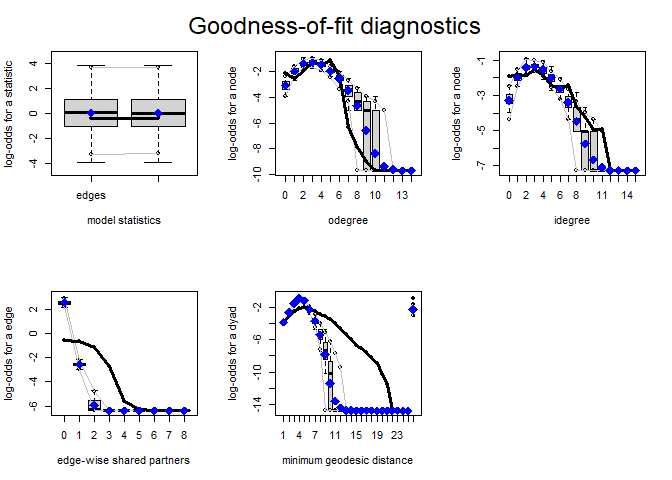

NCRM SNA Short Course Project
================
School of Health and Wellbeing - UofG
September, 2023

## Teenage Friends and Lifestyle Data

The data was downloaded from the SIENA Data Repository under Open
License Access, this also includes documentation for the Survey Design
by [West et
al. (1997)](https://www.stats.ox.ac.uk/~snijders/siena/Glasgow_data.htm).
The Glasgow Teenage data set consists of three waves, for the purpose of
this task we look at a cross-sectional snapshot extracting Wave 2
outcomes, as the first wave acts as a benchmark.

## 01 - Dependencies

Load dependencies including that of `library(statnet)` to be able to
parse data as a Network object. We also tap into data-processing
libraries including that of `library(dplyr)`.

```{r dependencies, echo=T, messages=F}
# Pass the set of libraries we intend to load as a list
libraries <- c("statnet","dplyr","ggplot2","formatR")

wants <- libraries
has   <- wants %in% rownames(installed.packages())

# Adapted code to check if packages have already been installed
if(any(!has)) install.packages(wants[!has])

lapply(wants, library, character.only=TRUE, warn.conflicts=F, quietly=T)
```

Next load the survey files covering aspects from students’ lifestyle to
friendship through the *Teenage Friends and Lifestyle Dataset*.

``` r
setwd("../SNA_Sept_2023/Glasgow_data/")

load("Glasgow-friendship.RData")
load("Glasgow-substances.RData")
load("Glasgow-geographic.RData")
load("Glasgow-demographic.RData")
load("Glasgow-geographic.RData")
load("Glasgow-lifestyle.RData")
load("Glasgow-various.RData")
```

## 02 - Read Network Data Structure

We map the elements of the Wave 2 friendship adjacency matrix onto a
network object.

``` r
require(statnet)

friend_binary <- as.matrix(friendship.2)

friend_binary[friend_binary == 1] <- 1
friend_binary[friend_binary == 2] <- 1
friend_binary[friend_binary == 10] <- 0

friendship_network <- as.network(friend_binary)
```

## 03 - Attach Vertex Attributes

Using the pipe operator `%v%` we assign vertex attributes to the
network.

The smoking variable has missing, `NA` values, but we recode these with a value of 1, 
`tobacco[is.na(tobacco)] <- 1`, this is in-line with coding practice that was followed
in the original survey, where 1 was assigned to non-smokers. 
In this way we assume all Null values to be missing
completely at random, in other words that there is no underlying process,
unobserved factors linked to the 'missing' nature of these observations.

``` r
tobacco[is.na(tobacco)] <- 1

# Add a new attribute
friendship_network %v% "Smoking" <- c(tobacco[, 2])
family_smoking <- as.numeric(familysmoking[, 2])

family_smoking[family_smoking == 1] <- 0
family_smoking[family_smoking == 2] <- 1
```

Next extract an indicator of parent smoking from the family smoking data
object. We recode the parent smoking variable solely for the purpose of
attributing a color property to the network graph.

``` r
friendship_network %v% "Parent_Smoking" <- family_smoking

# Get a list of vertex attributes
list.vertex.attributes(friendship_network)
```

    ## [1] "na"             "Parent_Smoking" "Smoking"        "vertex.names"

## 04 - Attach Edge Attributes

Similar to using the vertex pipe operator, `%v%`, we now assign the edge
operator, `%e%`, to include edge attributes to the network.

``` r
# Make an edge attribute
friendship_network %e% "Geographic Distance" <- as.matrix(distance.2)

list.edge.attributes(friendship_network)
```

    ## [1] "Geographic Distance" "na"

## 05 - Processing Network Data

After creating a vector containing arbitrary Student ID numbers, we map
these on to corresponding vertices.

``` r
friend_names <- c(1:160)

network.vertex.names(friendship_network) <- friend_names

sex_gender_shapes <- as.numeric(sex.F)
sex_gender_shapes <- recode(sex_gender_shapes, `2` = 1, `1` = 0)
```

## 06 - ERGM Model

In order to explore whether the likelihood of forming an edge tie is
higher than in the case of a random formation of ties, we run an initial
ERGM model that includes the endogenous covariate `edges`.

``` r
Model_1 <- ergm(friendship_network ~ edges)
```

    ## Starting maximum pseudolikelihood estimation (MPLE):

    ## Obtaining the responsible dyads.

    ## Evaluating the predictor and response matrix.

    ## Maximizing the pseudolikelihood.

    ## Finished MPLE.

    ## Evaluating log-likelihood at the estimate.

``` r
summary(Model_1)
```

    ## Call:
    ## ergm(formula = friendship_network ~ edges)
    ## 
    ## Maximum Likelihood Results:
    ## 
    ##       Estimate Std. Error MCMC % z value Pr(>|z|)    
    ## edges -3.84045    0.04449      0  -86.32   <1e-04 ***
    ## ---
    ## Signif. codes:  0 '***' 0.001 '**' 0.01 '*' 0.05 '.' 0.1 ' ' 1
    ## 
    ##      Null Deviance: 34011  on 24534  degrees of freedom
    ##  Residual Deviance:  5006  on 24533  degrees of freedom
    ##  
    ## AIC: 5008  BIC: 5016  (Smaller is better. MC Std. Err. = 0)

Given that the objective function uses the inverse logistic transform,
otherwise known as the sigmoid function, $\sigma(z)$,

$$
\sigma(z) = \frac{1} {1 + e^{-z}}
$$ 

The z-index in this case is our model estimation; however, we need to
feed these values into the function to interpret estimations in terms of
probability of tie formation at the network level, conditional on the
variables that we model at a given specification.

## 07 - Homophily by way of Smoking Habits

The starting point for this model arises from the question, *If Smokers
‘only ever’ befriend other Smokers, do Non-Smokers Behave the Same?*

This may shed some insight behind the way non-smokers go about forming
friendships, if they are to some extent indifferent between forming
‘within-group’ ties with other non-smokers and any other peer,
regardless of their smoking habits.

``` r
Model_2 <- ergm(friendship_network ~ edges + nodematch("Smoking"))
```

    ## Starting maximum pseudolikelihood estimation (MPLE):

    ## Obtaining the responsible dyads.

    ## Evaluating the predictor and response matrix.

    ## Maximizing the pseudolikelihood.

    ## Finished MPLE.

    ## Evaluating log-likelihood at the estimate.

``` r
summary(Model_2)
```

    ## Call:
    ## ergm(formula = friendship_network ~ edges + nodematch("Smoking"))
    ## 
    ## Maximum Likelihood Results:
    ## 
    ##                   Estimate Std. Error MCMC % z value Pr(>|z|)    
    ## edges              -4.3528     0.0951      0 -45.772   <1e-04 ***
    ## nodematch.Smoking   0.7176     0.1076      0   6.667   <1e-04 ***
    ## ---
    ## Signif. codes:  0 '***' 0.001 '**' 0.01 '*' 0.05 '.' 0.1 ' ' 1
    ## 
    ##      Null Deviance: 34011  on 24534  degrees of freedom
    ##  Residual Deviance:  4956  on 24532  degrees of freedom
    ##  
    ## AIC: 4960  BIC: 4977  (Smaller is better. MC Std. Err. = 0)

From model 1 the probability of network tie formation is
$\frac{1}{1+exp(-(3.84045))}=0.021$, 2.1 per cent higher than in a random
model.

Given that you are a non-smoker, the estimated probability of forming a
friendship with someone who is also a
non-smoker, $\frac{1}{1+exp(-(-4.3528+0.7176))}=0.0257$, is 2.57 per cent. That
is for non-smokers the probability of forming a within-level tie with
their peers is marginally higher, 0.4 per cent, compared to striking a
friendship with any other person regardless of their smoking habits.

These values change to $\frac{1}{1+exp(-(-4.3528+2(0.7176)))}=0.0512$ and
$\frac{1}{1+exp(-(-4.3528+3(0.7176)))}=0.0998$ for those occasionally and
regularly smoking, more than once a week. These correspond to a 3.02 (=5.12-2.57) and
7.88 (9.88 - 2.57) per cent, difference in within-smoking-level compared to
across-smoking-level formation. Note the probability of tie formation 
'across-smoking-level', that is regardless of others' smoking habits, is the
previously estimated edge coefficient from Model 1, this is no other than the proportion of
friendships out of all possible ties that students may form. In turn, the probability of 
'within-level' tie formation, striking a friendship with a peer who shares similar smoking habits,
is the probability of tie formation *in excess* of your disposition/willingness to form friendships.
The value is estimated at 2.57 per cent. All in all we might think that the probability of tie formation may
be reinforced by smoking behavior.

Homophily is pertinent to this case as it reflects the extent to which
pockets of higher *prevalence* of smoking exist. Against the context of a health intervention
this would slow the diffusion of information to teenagers at *higher risk* due to the close-knit
nature of their social groups.

## 08 - Model Fit

``` r
Model_01_GOF <- gof(Model_1, GOF = ~idegree + odegree + espartners +
    distance, verbose = TRUE, control = control.gof.ergm(seed = 12345))
```

    ## Starting GOF for the given ERGM formula.

    ## Conditional simulations for missing fit

    ## Starting GOF for the given ERGM formula.

    ## Calculating observed network statistics.

    ## Starting simulations.

    ## Starting MCMC iterations to generate 100 networks

    ## Calculating observed network statistics.

    ## Starting simulations.

    ## Starting MCMC iterations to generate 100 networks

``` r
par(mfrow = c(2, 3))
plot(Model_01_GOF, cex.lab = 1, cex.axis = 1, plotlogodds = TRUE)
```

<!-- -->

Next we can observe the fit of Model 2 for different ‘higher’ level
statistics of the model.

``` r
Model_02_GOF <- gof(Model_2, GOF = ~idegree + odegree + espartners +
    distance, verbose = TRUE, control = control.gof.ergm(seed = 12345))
```

    ## Starting GOF for the given ERGM formula.

    ## Conditional simulations for missing fit

    ## Starting GOF for the given ERGM formula.

    ## Calculating observed network statistics.

    ## Starting simulations.

    ## Starting MCMC iterations to generate 100 networks

    ## Calculating observed network statistics.

    ## Starting simulations.

    ## Starting MCMC iterations to generate 100 networks

``` r
par(mfrow = c(2, 3))
plot(Model_02_GOF, cex.lab = 1, cex.axis = 1, plotlogodds = TRUE)
```

<!-- -->

The model fit does not seem to improve much other than with the indegree
statistic. To interpret the plots we see that the black line fits the
observed value of the statistic given the network, while the blue dots
capture the median value of all statistics across simulations of the
network. The box-plot about this point captures the interquartile range,
25th through 75th percentile, about this value.

Where simulated and observed statistics do not overlap, we understand
that the observed network may not be ‘representative’ among those
simulated across our suite of networks.

It is interesting to note the poor fit against the geodesic, as the
edges are weighted by beeline distance this may conflate the poor fit
since naturally you would not measure the closest route to a person's
home through taking intermediate stops to your mutual friends’ homes, even
worse travelling along straight lines!! While weighing 
edges with this measure of distance proves an interesting visual exercise it
does not lend to an intuitive choice when it comes to accounting for friendship tie formations.
